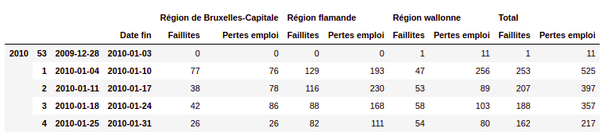
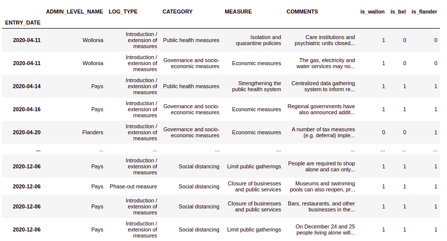
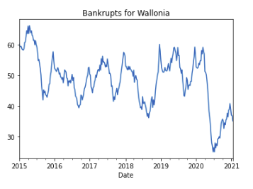
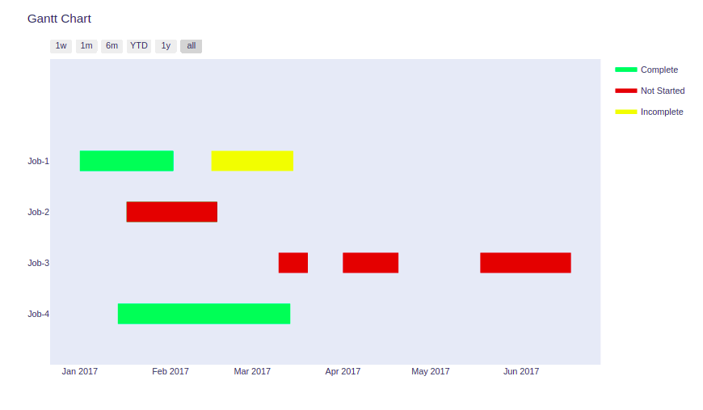

# workshop-IBM-covid

## Who

- [Morgane Demesmaeker](https://github.com/Demesmaeker?tab=repositories)
- [Christian Melot](https://github.com/Ezamey?tab=repositories)
- [Ousmane Diop](https://github.com/Nooreyni)

## What

After a really interesting presentation by [Damiaan Zwietering](https://gitlab.com/dzwietering/corona) from IBM, we were asked to do some analysis by ourselves to integrate some of his methodology and find new points of view that were not present in his presentation.

## When
- 19/01/2021
- 26/01/2021

## Duration
- 2 days.

## Preview

First we selected a few datasets that we supposed could hold interesting datas.

We explored them a bit and choose the two datasets with enough precise datas. Then, as usual, we cleaned them and merged them. 

Then we began some analysis. 
First we plot the number of dead people with the number of admission and number of patients currently in hospitals to have a better understanding of the covid crisis in Belgium.
We have plots based on regions (Brussels,Flanders,Wallonia).

Then we choose some other points of view :
1. Relative groth of both waves.

2. Deaths rate by hospitalization.

3. Focus on severity
 - hospitalized people
 - ICU (intensive care unit)
 - RESP (classic respirator)
 - ECMO (Extracorporeal membrane oxygenation)

4. Comparison between admissions and departures.

# A different point of view : 

## Analyse of the relations between bankrupts and government mesures for the covid situation.

We wanted to explore the covid effects outside the health situation. So we fetch the bankrupt datasets on [DataGov](https://data.gov.be/fr).

We wanted to link them to the different governemental       measures. 

After some cleaning so we did. What we find suprised us. 
Indeed, we expected more bankrupts due to the covid situation but instead it seems that the government helps really did their effects since compared to the number of companies going bankrupt in the previous years, the number of this year are really lower than you would have expected.

----
## TODO :

- Plot a correct Gantt chart of the differents governemental measures and link them to the bankrupts number.

___We aimed for :___

With different colors for each level of measures. 
_ie :one line will be a measure and a color a level of this measure._
Problem was we worked with a dataset without the finishing time and there wasn't  an explicit level for each measure and so it was really subjective. At the end of the day, we found others sets which could work better but we had not the time to work with them.