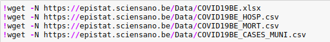

# workshop-IBM-covid

## Who

- [Morgane Demesmaeker](https://github.com/Demesmaeker?tab=repositories)
- [Christian Melot](https://github.com/Ezamey?tab=repositories)
- [Ousmane Diop](https://github.com/Nooreyni)

## What

After a really interesting presentation by [Damiaan Zwietering](https://gitlab.com/dzwietering/corona) from IBM, we were asked to do some analysis by ourselves to integrate some of his methodology and find new points of view that were not present in his presentation.

## When
- 19/01/2021

## Duration
- One day.

## Preview

First we selected a few datasets that we supposed could hold interesting datas.

We explored them a bit and choose the two datasets with enough precise datas. Then, as usual, we cleaned them and merged them. 

Then we began some analysis. 
First we plot the number of dead people with the number of admission and number of patients currently in hospitals to have a better understanding of the covid crisis in Belgium.
We have plots based on regions (Brussels,Flanders,Wallonia).

Then we choose some other points of view :
1. Relative groth of both waves.

2. Deaths rate by hospitalization.

3. Focus on severity
 - hospitalized people
 - ICU (intensive care unit)
 - RESP (classic respirator)
 - ECMO (Extracorporeal membrane oxygenation)

4. Comparison between admissions and departures.

